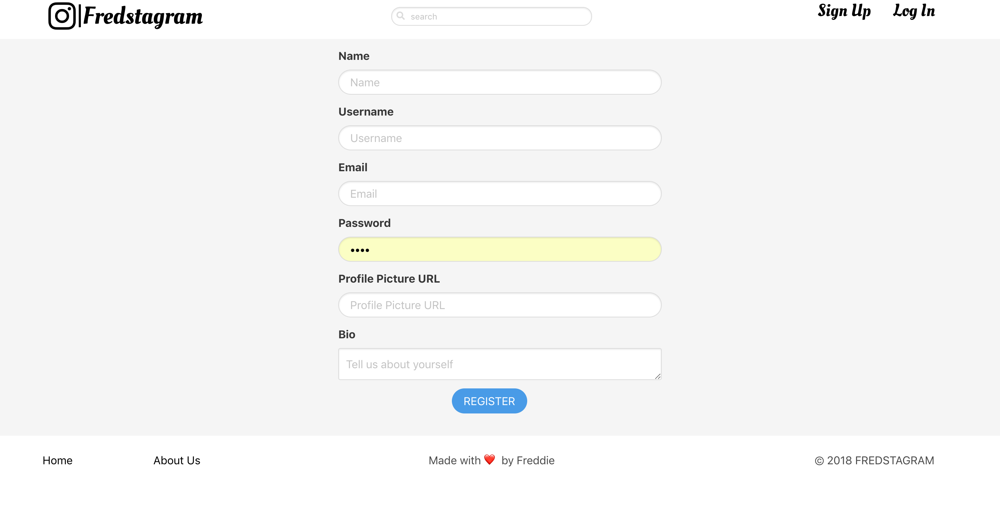
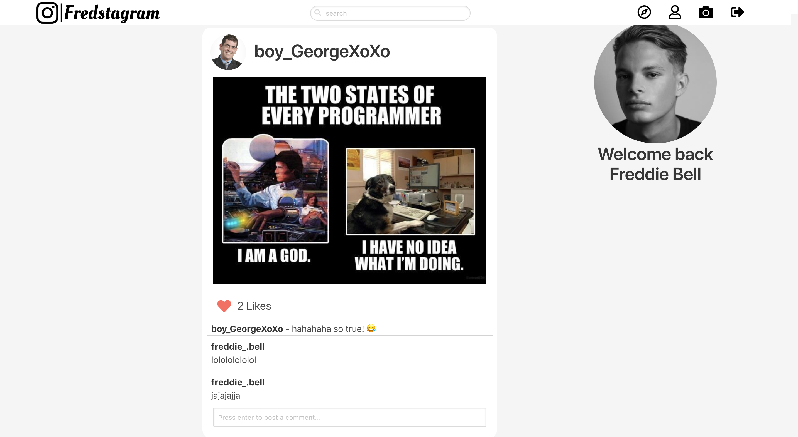
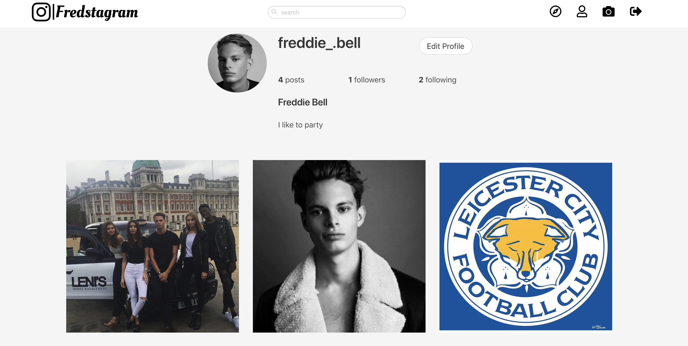

# General Assembly WDI Project 1: Fredstagram

[GitHub Pages](https://fred-bell.github.io/wdi-project-two/)

[Heroku Link](https://fredstagram.herokuapp.com/)

Fredstagram is my second project from General Assembly's Web Development Immersive course. It was an individual project built in just over a week, and was my first attempt at creating a data base for my app as well as my first large project using a CSS framework.

Fredstagram is an instagram clone photo sharing and social media platform.

___

## Screenshot Walk-through

### Home page when not logged in


### My registration page to create an account



### The home page when logged in is your post feed, it contains the post from the people you follow as well as your own posts



### When a picture is clicked on it takes you through to the show page


### Clicking on a users name or on the profile icon in the top right of the page takes you through to the profile page



### Clicking on the compass icon in the nav takes you to the explore page. Here a user can look through photos from anyone and find other users they might wish to follow. The post with the mouse hovering over it is highlighted.


---

## Brief

I had to:

* **Render a grid-based game in the browser**
* **Switch turns** between two players
* **Design logic for winning** & **visually display which player won**
* **Include separate HTML / CSS / JavaScript files**
* Use **Javascript or jQuery** for **DOM manipulation**
* Use **semantic markup** for HTML and CSS (adhere to best practices)

---

## Technologies Used:

* HTML5 with HTML5 audio
* CSS3 with animation
* Javascript (ECMAScript6)
* jQuery
* Git
* GitHub
* Google Fonts
* Photoshop

___

## Approach Taken

### Functionality

To begin the project I started work on my grid. I created a for loop that would use jQuery to create hundreds of numbered divs on my page and then it "cut out" the middle section I wanted to use. This gave me the grid size i wanted with each square having its own identifier number within it and meant that numbers at the edge of the grid weren't consecutive with numbers on the opposite side. This was intentional to stop movement over the edge of my map.

I then used objects to store the stats and location of my characters and worked on functions to handle their movement and attacks using the identifier numbers of my grid. All of this is controlled with the mouse and any changes that take place change the data in each characters object.

#### Featured piece of code 1

This piece of code generates the grid and numbers the squares accordingly. The large if statement selects the grid squares I wanted to keep for my game board. Further in my code all of the 'not-enterable' divs are removed from the page.

``` JavaScript
for(let i = 1; i < 600 ; i++){
  const $newDiv = $('<div></div>').addClass('not-enterable');
  $container.append($newDiv);
  if (i > 125 && i < 145 || i > 155 && i < 174 || i > 185 && i < 204 || i > 215 && i < 234
    || i > 245 && i < 264 || i > 275 && i < 294 || i > 305 && i < 324 || i > 335 && i < 354
    || i > 365 && i < 384 || i > 395 && i < 414 || i > 425 && i < 444 || i > 455 && i < 474){
    $newDiv.attr('class', 'grid-square');
    $newDiv.html(i);
  }
  if(i < 154 || i > 445){
    $newDiv.attr('class', 'not-enterable');
    $newDiv.html('');
  }
}
```
### MVP

This is a screenshot of when I felt I had reached my minimum viable product as my game now met every requirement of the brief.


### Styling

At this point in production I had only done minimal styling and had mainly focused on the logic to make sure my game ran. Next I focused on styling the game to make it more visually appealing to the user and to give more feedback on their interactions.


#### Featured piece of code 2

``` CSS
bit of css{
  which-is: good;
}

```

### Adding new features

blablabla about more variety in gameplay

___

## Wins and Blockers

blablabla


___

## Future Features

blablabla

* bla
* bla
* bla
