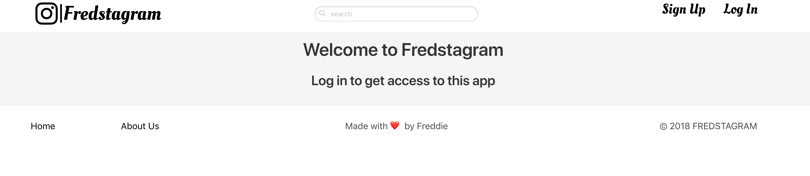
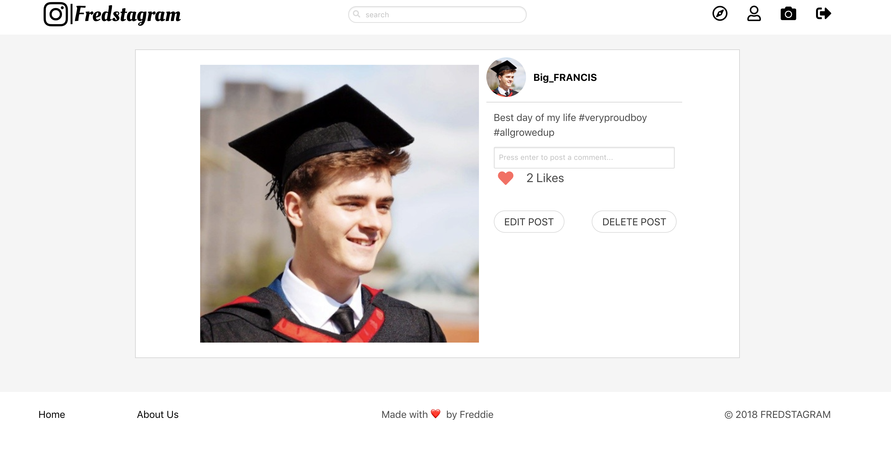

# General Assembly WDI Project 2: Fredstagram

[GitHub Pages](https://github.com/fwgbell/wdi-project-two)

[Heroku Link](https://fredstagram.herokuapp.com/)

Fredstagram is my second project from General Assembly's Web Development Immersive course. It was an individual project built in just over a week, and was my first attempt at creating a data base for my app as well as my first large project using a CSS framework.

Fredstagram is an instagram clone photo sharing and social media platform.

___

## Brief

To create a RESTful a photo sharing app, akin to an Instagram clone. The app had to had to meet the following criteria:
* Has a User model and user authentication
* Has models for photos and users
* Allows users to add, edit, and delete posts and comments.
* Users can only delete the comments and posts that they added.
* Is styled with Bulma, but doesn't look like Bulma

---

## Technologies Used:

* JavaScript (ECMAScript 6)
* CSS
* Node.js
* MongoDB
* EJS
* Express
* Mongoose
* Git
* Heroku

---

## Screenshot Walk-through

### Home page when not logged in



### My registration page to create an account


### The home page when logged in is your post feed, it contains the post from the people you follow as well as your own posts


### When a picture is clicked on it takes you through to the show page



### Clicking on a users name or on the profile icon in the top right of the page takes you through to the profile page


### Clicking on the compass icon in the nav takes you to the explore page. Here a user can look through photos from anyone and find other users they might wish to follow. The post with the mouse hovering over it is highlighted.


___

## Approach Taken

### Functionality

From the start of the project I wanted to create an as true to instagram clone as I could. To achieve this I went through their site making a note of all their features (following, feeds, likes, comments, etc) and tried to bring each of the major ones in to my site.


#### Featured piece of code 1

This piece of code in the back end handles post requests to the follow route. The follow button is displayed on a users profile page, when clicked it puts the username of the page the current logged in user is viewing in the body of the request. Then this piece of code pushes that in to the current logged in users following array.

``` JavaScript
function followProfileRoute (req, res){
  User
    .findById(res.locals.currentUser.id)
    .then(result => {
      req.body._id = req.params.id;
      result.following.push(req.body);
      result.save()
        .then(User.findById(req.params.id)
          .then(user => {
            user.followers = user.followers + 1;
            user.save()
              .then( () => res.redirect(`/profile/${req.params.id}`));
          })
        );
    });
}
```

### Styling

I took a similar approach to styling this project and wanted to keep it as authentic to instagram as possible. To fit the brief I used Bulma to get a starting point for the styling then put my own css on top of that.


#### Featured piece of code 2

This CSS is for the heart animation that overlaid on a photo briefly when a user clicks the like button. It's a feature from the actual site that I feel makes my project feel a lot more like it.

``` CSS
.love-heart{
  z-index: 2;
  position: absolute;
  color: white;
  font-size: 300px;
  left: 18%;
  top: 20%;
  opacity: 0;
}

@keyframes heartBeat {
  0%{opacity: 0;}
  50%{opacity: 0.8;}
  100%{opacity: 0;}
}

```
___

## Wins and Blockers

A big win was how quickly and smoothly I got the app's basic functionality working, including its RESTful routes.

Bulma was also somewhat of a challenge, since I hadn't used it much before. I had a clear idea of what I wanted the app to look like, and sometimes felt Bulma was hard to work with in that way, and that it was hard to make the app not look like Bulma defaults. But after some customisation, I managed to design an app I was happy with.


___
## Future Features

I think if I would more time to work on this project there are a number of things I would do to improve it. I would definitely work towards making it more mobile responsive as  I feel mobile use is a key feature of Instagram. I'd also like to implement some form of follow suggestions based on who you are currently following. I would also include time stamps in to the posts and comments and sort them by time added in the feed.
